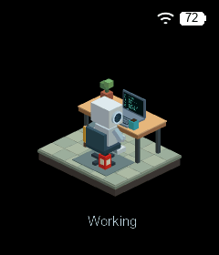

# Whisplay XiaoZhi

[English](README.md)


基于树莓派 + Whisplay HAT + PiSugar 电池的小智AI语音客户端。

使用 OTA 下发的 WebSocket 或 MQTT 凭据连接[小智AI平台](https://xiaozhi.me)，实现完整的语音交互流程：语音识别（ASR）、大模型对话（LLM）、语音合成（TTS），一个口袋大小的AI语音助手。也可以配置直连 WebSocket 地址连接自托管服务器。

## 功能

- **WebSocket 或 MQTT 语音对话** — 实现小智协议 v1，Opus 音频编解码
- **自动配对** — 设备在 LCD 上显示验证码，在 xiaozhi.me 输入即可绑定（无需手动填写 Token）
- **按键唤醒** — 按下按键唤醒设备并开始自动聆听（服务端 VAD 控制语音结束）
- **可选语音打断** — 检测到持续讲话时停止 TTS，并立即开始新一轮聆听
- **可配置 LCD UI** — 可选择经典状态/表情界面，或从 `whisplay-chatgpt` 移植的音频响应式水彩球
- **RGB LED** — 根据状态自动变色（空闲/聆听/思考/回答/错误）
- **电池监测** — PiSugar 电池电量实时显示
- **兼容 whisplay-daemon** — 检测到 daemon 时自动切换到 daemon 提供的 framebuffer / 按键 / LED
- **唤醒词** — 支持 openwakeword 免摆键唤醒
- **MCP 支持** — 服务端工具调用（JSON-RPC 2.0）
- **树莓派摄像头** — 通过 MCP 拍照并上传到服务端下发的视觉接口，把分析结果返回给模型

## 硬件需求

| 组件 | 说明 |
|------|------|
| 树莓派 | Zero 2W / Pi 4 / Pi 5 |
| Whisplay HAT | PiSugar Whisplay HAT（LCD + 麦克风 + 扬声器 + RGB LED + 按键） |
| PiSugar 电池 | 1200mAh / 5000mAh |
| WM8960 | 音频编解码器（HAT 自带） |
| 树莓派摄像头 | `rpicam-still`/`rpicam-vid` 或对应 `libcamera-*` 命令支持的摄像头（可选） |

## 快速开始

### 1. 安装

```bash
git clone https://github.com/PiSugar/whisplay-xiaozhi.git
cd whisplay-xiaozhi
bash install.sh
```

### 2. 配置

复制配置模板并按需修改：

```bash
cp .env.template .env
```

大部分配置开箱即用。设备会自动检测 MAC 地址并与服务器配对。

如果系统提供了 `whisplay-daemon`，请将本项目注册为 daemon 应用入口（`app_id: whisplay-xiaozhi`），并从 daemon 的应用管理中启动。

### 3. 运行

```bash
bash run.sh
```

### 4. 首次配对

首次启动时，LCD 屏幕会显示一个**验证码**（如 `123456`）。

1. 访问 [xiaozhi.me](https://xiaozhi.me) 并登录
2. 添加新设备，输入 LCD 上显示的验证码
3. 绑定成功后，设备自动连接，即可使用

配对凭证会保存在本地，后续启动无需重新配对。

### 5. 使用

- **按下按钮** → 唤醒设备，开始自动聆听（服务端 VAD 自动检测语音结束）
- **回答过程中按下按钮** → 打断当前回答，开始新对话
- **唤醒词** → 效果同按下按钮（需在配置中启用）

## 项目结构

```
whisplay-xiaozhi/
├── main.py                 # 入口文件
├── config.py               # 配置管理（读取 .env）
├── application.py          # 主状态机
├── protocol/
│   ├── websocket_client.py # 小智 WebSocket 协议客户端
│   ├── mqtt_client.py      # 小智 MQTT + UDP 协议客户端
│   ├── camera_tool.py      # 拍照、取景与视觉接口上传
│   └── mcp_handler.py      # MCP 工具调用处理
├── audio/
│   ├── audio_codec.py      # Opus 编解码
│   ├── audio_recorder.py   # 麦克风录音（sox）
│   └── audio_player.py     # 扬声器播放（sox）
├── hardware/
│   ├── whisplay_board.py   # Whisplay HAT 硬件抽象
│   ├── battery.py          # PiSugar 电池监测
│   └── led_controller.py   # RGB LED 控制
├── display/
│   ├── ui_renderer.py      # 经典界面及可配置帧率的水彩球界面
│   └── text_utils.py       # 文字/表情渲染工具
├── wakeword/
│   └── detector.py         # 唤醒词检测
├── iot/
│   ├── thing.py            # IoT 设备基类
│   └── thing_manager.py    # IoT 设备管理
├── assets/
│   ├── emoji_svg/          # Emoji SVG 图标
│   └── logo.png            # 启动 Logo
├── service/
│   └── whisplay-xiaozhi@.service  # systemd 服务
├── requirements.txt
├── install.sh
├── run.sh
├── .env.template
└── README.md
```

## 配置说明

### 开启水彩球

<p align="center">
  
</p>

如果还没有 `.env`，先复制配置模板，然后启用水彩界面。以下是经过 Zero 2 W
及更新树莓派验证的高画质配置：

```bash
cp -n .env.template .env
```

```dotenv
DISPLAY_UI_STYLE=watercolor
WATERCOLOR_FPS=8
WATERCOLOR_RENDER_SCALE=0.60
WATERCOLOR_SMOOTH_FBM=true
WATERCOLOR_TEMPORAL_3D=true
WATERCOLOR_THREADS=2
```

使用独立 systemd 服务时重启 `whisplay-xiaozhi@pi`；通过
`whisplay-daemon` 运行时，从应用菜单退出并重新启动小智。聆听时麦克风音量会
扩张球体轮廓，助手说话时 TTS 音频会驱动内部颜料流动。

设置 `BARGE_IN_ENABLED=true` 可启用语音打断。如果扬声器回声导致误触发，
请提高 `BARGE_IN_MIN_RMS`。

### 开启 3D 工位机器人


在 `.env` 中设置以下参数并重启应用：

```dotenv
DISPLAY_UI_STYLE=robot
ROBOT_FPS=30
ROBOT_SLEEP_AFTER=45
```

屏幕中央是一小块等距视角的立体方块地图，镜头从机器人右后方越肩看向工位，
笔记本屏幕朝向机器人，键盘在它身前。小手臂使用固定长度的两段关节。
闲置时机器人会随机回头，朝用户停留 2.5～4.5 秒、轻微抬头并眨眼，再自然转回；
回头间隔、速度和日常眨眼时间都有变化，闲置时偶尔坐着交替踢脚或伸懒腰：
双臂向上舒展、轻轻后仰眯眼、稍作停留后放松，约 4.3 秒，与踢脚和回头错开。
还会随机朝用户转头挥手打招呼，或抬起左手腕低头查看发光的小表盘；
两种动作各约 3.8 秒，与其他闲置动作互斥，工作或唤醒时平滑退出。
闲置达到 45 秒后，随机选择趴桌睡觉或在笔记本上玩像素射击游戏；游戏持续约
18～28 秒，之后休息 35～60 秒，继续闲置时轮换。睡觉时左手搭桌、右手下垂；连接、激活、说话或
显示工具执行状态时敲键盘，等待回复的 `thinking` 状态会抬右手挠头、轻微歪头，
聆听和拍照会唤醒它。笔记本显示变化的装饰性命令行。
工作时头部轻微左右扫视屏幕，随机穿插短暂思考和拿杯喝水（拿起、轻倾、放回），
再继续打字；这些小动作不会改变实际语音状态，遇到真正的聆听、思考或突发事件会让位。
睡眠时明亮的 “Z” 会在头顶高处向上飘。长按按钮约 0.65 秒，镜头绕地面法线
用 0.9 秒平滑旋转 90°；每次按住只转一次，四次回到原视角。短按唤醒、双击拍照不变。
照片以机器人上方的小缩略图显示，等比例居中裁切铺满弹窗、不留底色边框，
沿用 `CAMERA_PREVIEW_SECONDS`，不会替换整个工位。
Wi-Fi、电池、字幕排版与分页沿用水彩球模式及 `WATERCOLOR_CAPTION_*` 设置。
机器人和水彩球模式会把正文中的 `%工具名...` 提取为字幕上方独立的蓝色工具标签，
重复调用显示次数；工具进度不再覆盖字幕，也不会重置字幕的分页计时。

默认开启随机小事件：电脑起火时先受惊缩手，扭头俯身从椅子下拿灭火器，瞄准火焰喷泡沫后放回；
下雨时先抬头、缩肩遮雨，再俯身拿伞、举到头顶中央，撑好后单手继续工作。
事件分别持续约 13 秒和 16 秒，会自动恢复正常姿态，且不会重叠。
首次在允许播放的清醒时间累计 18～35 秒后随机出现，之后间隔 40～90 秒；睡觉时
不启动，聆听、思考、工具状态或照片预览会让当前事件在约 0.45 秒内淡出。
设置 `ROBOT_EVENTS_ENABLED=false` 可关闭。事件仅影响画面，不改变对话或音频状态。



可用 `python tools/preview_robot.py --events --output /tmp/robot-events.gif` 预览两个完整事件。

场景与动画用 Rust 软件光栅化，缓存静态几何和深度，使用两倍分辨率抗锯齿，
释放 Python GIL 后直接输出 RGB565。`ROBOT_FPS` 是目标帧率，实际流畅度还取决于
树莓派负载与 SPI 传输速度。Linux AArch64 预编译包同时包含水彩球和机器人，
兼容系统无需现场编译。升级时若 `display/_watercolor_rust.so` 是旧版本，请用
`rust/watercolor_renderer/prebuilt/linux-aarch64/_watercolor_rust.so` 覆盖后重启。
构建环境和兼容要求见该目录的 `BUILD.md`。其他平台先执行
`bash tools/build_watercolor_rust.sh`；脚本也支持在 macOS 上构建和预览：

```bash
python tools/preview_robot.py --output /tmp/robot-workstation.gif
```

### Rust 水彩球渲染器

水彩模式统一使用 Rust 渲染器；缺少兼容扩展时会明确报错，不再回退到
Python 像素渲染。工程已包含在 CM5 上编译、并在 Zero 2 W 上验证过的 Linux AArch64
预编译扩展：`rust/watercolor_renderer/prebuilt/linux-aarch64/_watercolor_rust.so`。
程序会优先加载 `display/` 中的部署版本，找不到时直接加载该归档版本。
原生路径复刻了 ChatGPT 的三个对数音频频段、独立颜料累计相位、线性加深混色
以及水彩纹理，因此讲话时三层颜料会以不同方向和速度流动。

需要重新构建时，请在安装了 Rust 的 AArch64 设备上执行（CM5 即可）：

```bash
bash tools/build_watercolor_rust.sh
```

脚本会将产物归档到上述 `prebuilt/linux-aarch64` 目录，并复制一份到
`display/_watercolor_rust.so` 供当前环境使用。Zero 2 W 推荐设置
`WATERCOLOR_THREADS=2`；四线程帧率更高，但留给音频和网络的 CPU 余量更少。
在 32 位 Raspberry Pi OS 上，同一脚本会原生构建相同的 Rust 渲染器，并归档到
`prebuilt/linux-armv7l` 或 `prebuilt/linux-armv6l`。安装程序会自动选择对应架构；
Python 只负责字幕排版，不再负责水彩球像素渲染。

| 变量 | 说明 | 默认值 |
|------|------|--------|
| `XIAOZHI_OTA_URL` | OTA / 激活 API 地址 | `https://api.tenclass.net/xiaozhi/ota/` |
| `XIAOZHI_DEVICE_ID` | 设备ID（留空自动获取MAC） | — |
| `XIAOZHI_CLIENT_ID` | 客户端 UUID（留空自动生成） | — |
| `XIAOZHI_WS_URL` | 直连 WebSocket 地址；设置后绕过 OTA | — |
| `XIAOZHI_WS_TOKEN` | 直连 WebSocket Token；服务器无需鉴权时可以留空 | — |
| `ALSA_INPUT_DEVICE` | ALSA 录音设备 | `default` |
| `ALSA_OUTPUT_DEVICE` | ALSA 播放设备 | `default` |
| `BARGE_IN_ENABLED` | 允许语音打断助手 TTS | `false` |
| `BARGE_IN_MIN_RMS` | 触发打断所需的最低原始 PCM RMS | `850` |
| `BARGE_IN_REQUIRED_FRAMES` | 连续语音帧数量，每帧 60 ms | `4` |
| `BARGE_IN_WARMUP_MS` | 每次回答开始时的回声学习时长 | `350` |
| `WAKE_WORD_ENABLED` | 启用唤醒词 | `false` |
| `WAKE_WORDS` | 唤醒词列表（逗号分隔） | `hey_jarvis` |
| `LCD_BRIGHTNESS` | LCD 亮度 (0-100) | `100` |
| `DISPLAY_SCROLL_SPEED` | 文字每帧滚动像素数 | `1.0` |
| `DISPLAY_UI_STYLE` | LCD 界面：`classic`、`watercolor` 或 `robot` | `classic` |
| `ROBOT_FPS` | 机器人目标帧率，1–60 | `30` |
| `ROBOT_SLEEP_AFTER` | 机器人闲置多久后睡觉（秒，最小 5） | `45` |
| `ROBOT_EVENTS_ENABLED` | 开启随机起火灭火、雨云撑伞动画 | `true` |
| `WATERCOLOR_FPS` | 水彩球动画帧率（1-20） | `8` |
| `WATERCOLOR_DIAMETER` | 水彩球直径像素（100-220） | `168` |
| `WATERCOLOR_RENDER_SCALE` | 内部渲染比例，越低越省性能（0.2-1.0） | `0.37` |
| `WATERCOLOR_SMOOTH_FBM` | 在高性能设备上启用平滑 FBM 采样 | `false` |
| `WATERCOLOR_TEMPORAL_3D` | 启用更高质量的时域噪声 | `false` |
| `WATERCOLOR_AUDIO_REACTIVITY` | 助手音频形变增益（0.5-5.0） | `3.6` |
| `WATERCOLOR_SPEECH_MOTION` | 助手颜料运动增益（0.5-5.0） | `4.5` |
| `WATERCOLOR_THREADS` | 原生渲染器工作线程数（1-4） | `2` |
| `WATERCOLOR_CAPTION_PAGE_SECONDS` | 每页字幕的最短显示秒数 | `3.0` |
| `WATERCOLOR_CAPTION_FONT_SIZE` | 水彩球字幕字号（10-24 像素） | `15` |
| `WATERCOLOR_CAPTION_OFFSET_X` | 水彩球字幕水平偏移（-20 到 20，正值向右） | `3` |
| `PISUGAR_ENABLED` | 启用电池监测 | `true` |
| `XIAOZHI_LOCAL_COMMAND_TOOL_ENABLED` | 向小智暴露 `local_command` MCP 工具 | `true` |
| `XIAOZHI_LOCAL_COMMAND_ALLOWLIST` | `local_command` 允许执行的命令名，逗号分隔 | `date,uptime,hostname,whoami,df,free,ip,iwgetid,vcgencmd` |
| `XIAOZHI_LOCAL_COMMAND_UNSAFE` | 允许执行任意本地程序；仅可信设备/网络使用 | `false` |
| `XIAOZHI_LOCAL_COMMAND_USE_SHELL` | 为 `local_command` 启用 shell 语法；需要同时启用 unsafe | `false` |
| `XIAOZHI_LOCAL_COMMAND_TIMEOUT_SEC` | 单次本地命令最长执行秒数 | `5` |
| `XIAOZHI_LOCAL_COMMAND_CHECK_INTERVAL_SEC` | 后台任务 `checkCommand` 返回之间的最小间隔秒数 | `5` |
| `XIAOZHI_LOCAL_COMMAND_OUTPUT_LIMIT` | 返回 stdout/stderr 的最大字符数 | `4000` |
| `XIAOZHI_WEB_TOOLS_ENABLED` | 向小智暴露 `fetch_webpage` 和 `web_search` MCP 工具 | `true` |
| `XIAOZHI_WEB_TOOL_PROXY` | 网页工具使用的可选代理；为空时回退到 `HTTPS_PROXY`/`HTTP_PROXY`/`ALL_PROXY` | — |
| `XIAOZHI_WEB_TOOL_TIMEOUT_SEC` | 网页工具 HTTP 请求超时秒数 | `15` |
| `XIAOZHI_WEB_TOOL_TEXT_LIMIT` | 返回网页正文的最大字符数 | `6000` |
| `XIAOZHI_WEB_TOOL_LINK_LIMIT` | 单个网页返回链接数量上限 | `30` |
| `XIAOZHI_WEB_SEARCH_RESULT_LIMIT` | 单次网页搜索返回结果上限 | `5` |
| `XIAOZHI_GOOGLE_SEARCH_API_KEY` | `search_type=sites` 使用的 Google Programmable Search JSON API key | — |
| `XIAOZHI_GOOGLE_SEARCH_ENGINE_ID` | `search_type=sites` 使用的 Google Programmable Search Engine ID (`cx`) | — |
| `XIAOZHI_CAMERA_TOOL_ENABLED` | 向小智暴露官方 `self.camera.take_photo` MCP 工具 | `false` |
| `XIAOZHI_CAMERA_COMMAND` | 静态拍照命令覆盖；留空自动检测 `rpicam-still`/`libcamera-still` | — |
| `XIAOZHI_CAMERA_VIEWFINDER_COMMAND` | 实时取景命令覆盖；留空自动检测 `rpicam-vid`/`libcamera-vid` | — |
| `XIAOZHI_CAMERA_INDEX` | 传给 `rpicam-still` 的摄像头编号 | `0` |
| `XIAOZHI_CAMERA_WIDTH` | 默认拍照宽度（160-1280） | `1280` |
| `XIAOZHI_CAMERA_HEIGHT` | 默认拍照高度（120-960） | `960` |
| `XIAOZHI_CAMERA_QUALITY` | JPEG 质量（30-95） | `90` |
| `XIAOZHI_CAMERA_WARMUP_MS` | 静态拍照前的摄像头预热毫秒数 | `2000` |
| `XIAOZHI_CAMERA_TIMEOUT_SEC` | 静态拍照进程超时秒数 | `15` |
| `XIAOZHI_CAMERA_VISION_TIMEOUT_SEC` | 视觉服务上传与分析超时秒数 | `60` |
| `XIAOZHI_CAMERA_VIEWFINDER_WIDTH` | 手动实时取景宽度（320-1280） | `640` |
| `XIAOZHI_CAMERA_VIEWFINDER_HEIGHT` | 手动实时取景高度（240-960） | `480` |
| `XIAOZHI_CAMERA_VIEWFINDER_FPS` | 用户拍照实时取景帧率 | `5` |
| `XIAOZHI_CAMERA_VIEWFINDER_QUALITY` | 手动实时取景 JPEG 质量（40-90） | `75` |
| `XIAOZHI_CAMERA_VIEWFINDER_READY_TIMEOUT_SEC` | 等待首个取景帧的超时秒数 | `10` |
| `XIAOZHI_CAMERA_MAX_FRAME_BYTES` | 允许的取景 JPEG 帧最大字节数 | `2097152` |
| `XIAOZHI_CAMERA_DOUBLE_CLICK_SECONDS` | 双击进入取景模式的最大按键间隔 | `0.38` |
| `XIAOZHI_CAMERA_OUTPUT_DIR` | 照片本地保存目录 | `data/camera` |
| `XIAOZHI_CAMERA_KEEP_CAPTURES` | 保留的近期自动 `capture-*` 照片数量 | `10` |
| `XIAOZHI_CAMERA_AUTOFOCUS` | 拍照前触发自动对焦（Camera Module 3/IMX708） | `true` |
| `XIAOZHI_CAMERA_AUTOFOCUS_RANGE` | 自动对焦范围：`normal`、`macro` 或 `full` | `full` |
| `XIAOZHI_CAMERA_AUTOFOCUS_SPEED` | 自动对焦速度：`normal` 或 `fast` | `fast` |
| `XIAOZHI_CAMERA_PREVIEW_SECONDS` | 小智主动拍照后的 LCD 预览秒数 | `2` |
| `XIAOZHI_CAMERA_USER_PHOTO_PREVIEW_SECONDS` | 用户按钮拍照后的 LCD 预览秒数 | `2` |

此表列出主要配置；其他可部署设置及行内说明请查看 [`.env.template`](.env.template)。

## MCP 工具

当小智网关启用 MCP 时，设备会注册 `local_command` 工具。工具接收
`command` 字符串和可选的 `timeout`，不经过 shell 直接在本机执行命令，
并返回 `stdout`、`stderr` 和 `exit_code`。如果命令运行超过
`XIAOZHI_LOCAL_COMMAND_TIMEOUT_SEC`，命令会转入后台继续执行，并返回
`status=running` 和 `job_id`；后续可用 `checkCommand` 读取最新输出或最终结果，
也可用 `stopCommand` 停止任务。默认只允许执行
`XIAOZHI_LOCAL_COMMAND_ALLOWLIST` 中列出的命令名。如需开放任意命令，
可设置 `XIAOZHI_LOCAL_COMMAND_UNSAFE=true`，但只应在完全可信的设备和网络中使用。
如果需要管道、重定向、`&&` 或 sudo 密码管道等 shell 功能，还需要设置
`XIAOZHI_LOCAL_COMMAND_USE_SHELL=true`。

当 `XIAOZHI_WEB_TOOLS_ENABLED=true` 时，设备还会注册：

- `fetch_webpage`：获取 HTTP(S) 网页，返回页面标题、可读正文和链接列表；也可以通过 `link_text` 或 `link_index` 继续打开当前页或上一页里的链接。
- `web_search`：搜索网页并返回简洁的标题和 URL 列表。`search_type=web` 使用 DuckDuckGo HTML，`search_type=news` 使用 Google News RSS，`search_type=sites` 在配置后使用 Google Programmable Search JSON API。

设置 `XIAOZHI_WEB_TOOL_PROXY` 可以让这些网页请求走代理；留空时会自动使用
已有的标准代理环境变量。

当 `XIAOZHI_CAMERA_TOOL_ENABLED=true` 时，设备会独立注册
`self.camera.take_photo`。该工具拍摄 JPEG、上传到 MCP 初始化时由服务器下发的鉴权
视觉接口，并把视觉服务返回的 JSON 或文本分析作为 MCP 文本内容交给模型；JPEG 本身
不会作为 MCP 图片内容块返回。必填参数 `question` 用于说明需要识别的内容；传入
`use_selected_photo=true` 时，会分析最近一次通过按钮拍摄的照片，而不是重新拍照。

手动拍照时，双击按钮进入实时取景，单击保存当前画面。随后设备会重连、自动进入
聆听状态，并临时修改摄像头工具描述，引导托管模型在下一次请求中使用这张照片。
这只是工具选择提示，并不是真正的协议级多模态附件：如果托管模型没有调用
`self.camera.take_photo`，照片不会自动进入该轮对话。工具被调用时，程序会优先使用
待处理的手动照片。手动 `user-photo-*` 文件不受自动 `capture-*` 照片轮换清理影响。
经典 UI 全屏显示照片预览，水彩模式则在球体圆圈内显示。

## 开机自启

```bash
# 安装 systemd 服务（替换 pi 为你的用户名）
sudo cp service/whisplay-xiaozhi@.service /etc/systemd/system/
sudo systemctl enable whisplay-xiaozhi@pi
sudo systemctl start whisplay-xiaozhi@pi

# 查看日志
sudo journalctl -u whisplay-xiaozhi@pi -f
```

如果系统里已经在运行 `whisplay-daemon`，请直接从 daemon 注册的 `whisplay-xiaozhi` 应用入口启动，而不是再通过 `startup.sh` 安装独立服务。

## 协议参考

本项目实现了小智 ESP32 WebSocket 协议 v1：
- [xiaozhi-esp32](https://github.com/78/xiaozhi-esp32)
- [py-xiaozhi](https://github.com/huangjunsen0406/py-xiaozhi)
- [OTA 激活](https://my.feishu.cn/wiki/FjW6wZmisimNBBkov6OcmfvknVd) 设备通过 HTTP 注册，用户输入验证码绑定
- [协议文档](https://my.feishu.cn/wiki/M0XiwldO9iJwHikpXD5cEx71nKh) WebSocket 连接 + Hello 握手 + Opus 音频流 + JSON 控制消息

## License

GPL-3.0
